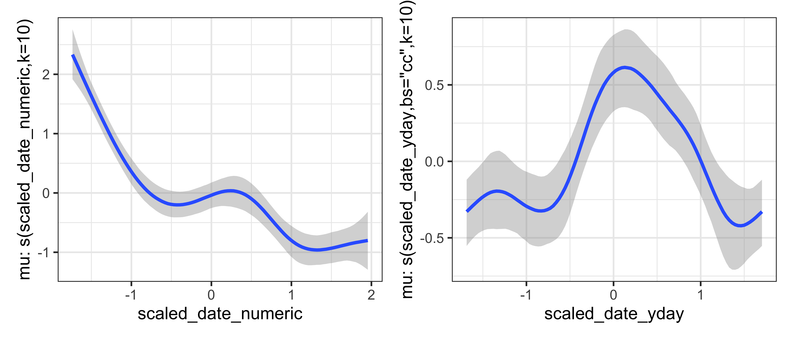

<!-- README.md is generated from README.Rmd. Please edit that file -->

# bgamcar1

<!-- badges: start -->

[](https://app.codecov.io/gh/bentrueman/bgamcar1?branch=master)
[](https://zenodo.org/badge/latestdoi/479471503)
[](https://github.com/bentrueman/bgamcar1/actions/workflows/R-CMD-check.yaml)
<!-- badges: end -->

The `bgamcar1` package documents the bespoke functions used in the paper
“Comparing corrosion control treatments for drinking water using a
robust Bayesian generalized additive model”, now available as a [journal
article](https://doi.org/10.1021/acsestengg.2c00194), with data and code
in a separate [repository](https://github.com/bentrueman/compare-cct).
`bgamcar1` fits Bayesian generalized additive models with
continuous-time first-order autoregressive (CAR(1), Pinheiro et al.,
2021) errors, Student *t* likelihoods, and (optional) censoring. The
functions are wrappers around or alternatives to existing `brms`
functions (Bürkner, 2017, 2018), addressing a [current
gap](https://github.com/paul-buerkner/brms/issues/741) in the models
`brms` can fit.

## Installation

You can install the development version of bgamcar1 from
[GitHub](https://github.com/) with:

``` r
# install.packages("devtools")
devtools::install_github("bentrueman/bgamcar1")
```

## Example

Below is a quick demonstration of the main functions. First load the
simulated data; all input variables are centered and scaled to unit
variance (the response was log-transformed before scaling). The
data-generating process sums a nonlinear multiyear trend, a seasonal
trend with a peak in August, and CAR(1)-filtered Student-*t* errors.
Censoring should be indicated using a character vector with the values
“left”, “right”, “interval”, and “none”.

``` r

library("ggplot2")
library("dplyr")
library("brms")
library("loo")
library("ggdist")
library("bgamcar1")
theme_set(theme_bw())
options(mc.cores = parallel::detectCores())
rseed <- 2356
simdat <- readr::read_csv("man/models/data-simulated.csv")
```

Then fit the model:

``` r

bform <- bf(
  scaled_lead | cens(cens_lead) ~
  s(scaled_date_numeric, k = 10) +
    s(scaled_date_yday, bs = "cc", k = 10) +
    ar(time = scaled_date_numeric)
)

fit <- fit_stan_model(
  "man/models/demo", rseed, bform, simdat,
  save_warmup = FALSE, iter = 3000,
  warmup = 1000
)
```

Generate predictions using `add_pred_draws_car()`…

``` r

preds_car1 <- add_pred_draws_car1(simdat, fit, draw_ids = 1:8000)
fitted_car1 <- ggdist::median_qi(preds_car1, .epred)
```

… and plot the data and the model predictions:

``` r

fitted_car1 %>%
  mutate(
    across(
      c(.epred, .lower, .upper),
      ~ retrans(.x, lead, recensor = TRUE)
    )
  ) %>%
  ggplot(aes(date)) +
  geom_line(aes(y = lead, col = "Data")) +
  geom_ribbon(
    aes(ymin = .lower, ymax = .upper, fill = "GAM + CAR(1)"),
    col = NA, alpha = .3, show.legend = FALSE
  ) +
  geom_line(aes(y = .epred, col = "GAM + CAR(1)")) +
  scale_y_log10() +
  scale_color_manual(values = c("grey50", "#3366FF")) +
  scale_fill_manual(values = "#3366FF") +
  labs(x = NULL, y = "response", col = NULL)
```


Functions in `brms` that don’t involve the autocorrelation term can
still be used:

``` r

brms::conditional_smooths(fit) %>%
  plot(ask = FALSE, newpage = FALSE, plot = FALSE) %>%
  patchwork::wrap_plots()
```



Do a quick posterior predictive check. This is based on the function
`cenfit()` from the `NADA` package (Lopaka, 2020).

``` r

ppc <- ppc_km_nada(simdat, fit, seed = rseed)

ppc %>%
  ggplot(aes(obs, prob, col = type, group = .draw)) +
  geom_line() +
  scale_color_manual(values = c("#3366FF", "grey70")) +
  coord_cartesian(xlim = c(-5, 5)) +
  labs(x = "Observation", y = "Probability", col = NULL)
```


Finally, compare models using approximate leave-one-out
cross-validation, using `loo_cv()`, a wrapper around `loo::loo()`
(Vehtari & Gabry, 2017).

``` r

loo_car1 <- loo_cv(simdat, fit, draw_ids = 1:8000)
loo_gam <- loo_cv(simdat, fit, car1 = FALSE, draw_ids = 1:8000)

loo::loo_compare(loo_car1, loo_gam)
#>        elpd_diff se_diff
#> model1   0.0       0.0  
#> model2 -13.2       4.5
```

# References

Lopaka Lee (2020). NADA: Nondetects and Data Analysis for Environmental
Data. R package version 1.6-1.1.
<https://CRAN.R-project.org/package=NADA>

Paul-Christian Bürkner (2017). brms: An R Package for Bayesian
Multilevel Models Using Stan. Journal of Statistical Software, 80(1),
1-28. <https://doi.org/10.18637/jss.v080.i01>

Paul-Christian Bürkner (2018). Advanced Bayesian Multilevel Modeling
with the R Package brms. The R Journal, 10(1), 395-411.
<https://doi.org/10.32614/RJ-2018-017>

Pinheiro J, Bates D, DebRoy S, Sarkar D, R Core Team (2021). *nlme:
Linear and Nonlinear Mixed Effects Models*. R package version 3.1-153,
<https://CRAN.R-project.org/package=nlme>

Vehtari A, Gelman A, Gabry J (2017). “Practical Bayesian model
evaluation using leave-one-out cross-validation and WAIC.” *Statistics
and Computing*, *27*, 1413-1432.
<https://doi.org/10.1007/s11222-016-9696-4>
